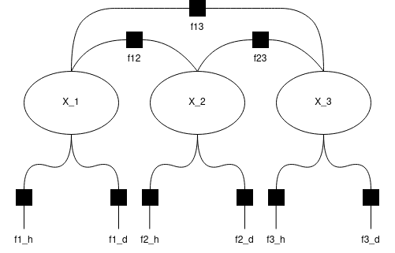

# Jakub Szukała - SIWR Bounding Boxes Matching

Solution submition to bounding boxes matching problem.

#### Project structure description
- There are two utility classes representing bounding box (*BBox*) and a single frame (*Frame*)
- Main functionalities are contained inside *Matcher* class. This class constructs the graph and performs inference.
- There is also a utility function parsing the files and the main inference loop, all this is described in code.

#### Solution description
Solution to the problem involves constructing a *FactorGraph* and then using *BeliefPropagation* to infer. For each pair of frames a separate graph is constructed.

As a central point in the graph we have **variable nodes X_i** that represent indexes to predict / match on the secnod frame. So their number is n = number of boxes on second frame. These variables after *BeliefPropagation* will take the most probable values of bounding boxes indexes.

On the graph there are few factors defined:
- Factor that prohibits duplication (in code added in *add_duplication_avoidance_factors*) - these factors connect each node with all other nodes. Values in these factors are matrix that has ones on all positions except main diagonal (so if i == j then value is 0). Also value at [0, 0] is 1. Structure of this matrix prevents the case, where two nodes (X_i) will have the same value, as 0 in this matrix is essentially prohibited state. It still is possible though, for zero or more nodes to have value 0 (here, a value meaning that there is no match found).
- Factor measuring histogram similarity between boxes from the first frame and boxes from the second frame - this factor will force the node to take the index value of the box with the highest histogram similarity. If all histograms are below certain threshold, the node will be forced to take value of 0 (-1 in results).
- Factor measuring distances between each box on the first frame and each box on the second frame - this factor will force node to take value with the box index that is the closest to it. If no box is closer than LIKELY_MAX_DISTANCE hyperparameter, then this factor will force node to take value of 0 (-1 in results).

Below on an image, example of a graph for inference scenario where frame 1 has 1 box present and frame 2 has 3 boxes:
- X_j - node representing a box from the second frame
- fi_h - factor from histogram comparision between frame 1 box and a box from second frame described by a node X_j
- fi_h - factor from distance calculation between frame 1 box and a box from second frame described by a node X_j
- fjk - factor prohibiting nodes from taking the same values (two nodes picking the same box from frame 1)

